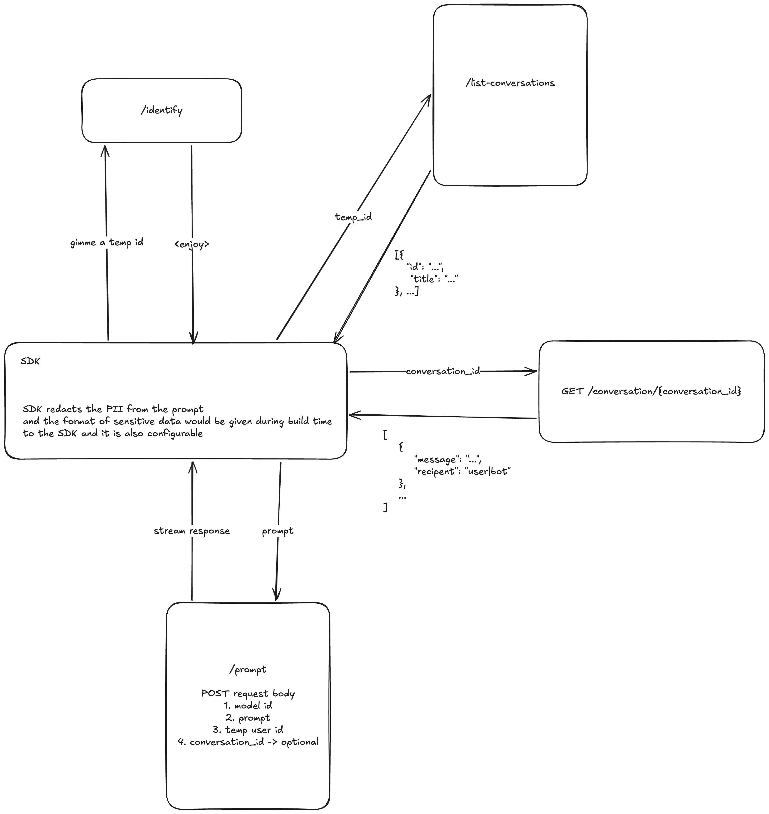
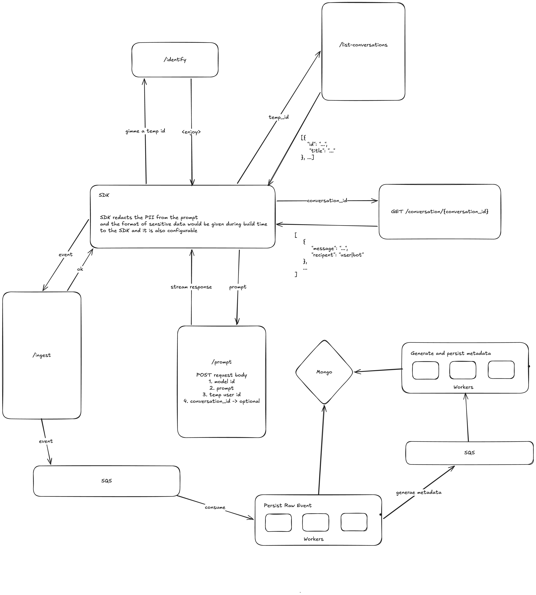

# Setup 
Clone this repository 

```
git clone https://github.com/Rahul-Baradol/bounce-a-bot.git
```

Have docker installed. Please refer the [docs](https://docs.docker.com/desktop/setup/install/windows-install/)

Rename .env.example to .env in frontend and backend folder.

Run the following in frontend folder
```
npm install
npm run build
```

Run the following in backend folder
```
python3 -m venv .venv 
source .venv/bin/activate
pip install -r requirements.txt

Then run 
```
docker compose up
```

That's it !

Visit http://localhost:5173

Architecture 1



One principle I followed throughout -- Keep the design simple and practical for what is needed.

Tradeoffs
- Auth is simplistic: guest auth with localStorage-backed user identifiers.
- LLM responses are mocked, to not obviously burn the credits, but the clients are easy and plug in...
- Metrics are stored in MongoDB. Good and simple initially, but hard to scale with more logs coming in 

### Design 1 — Key Design Decisions

* **Guest-first authentication**

  * No signup/login friction.
  * SDK generates and persists a temporary user identifier in `localStorage`.
  * Good for demos, internal tooling, prototypes, and low-friction onboarding.
  * Avoids session management, JWT rotation, OAuth complexity, etc.

* **SDK acts as the trust boundary**

  * Redaction rules are configurable during SDK initialization/build time.
  * Keeps privacy logic centralized instead of duplicating it across services.

* **Thin backend architecture**

  * Backend only exposes a few focused endpoints:

    * `/identify`
    * `/prompt`
    * `/list-conversations`
    * `/conversation/{id}`
    * `/ingest`
  * Easier to reason about and faster to iterate on.
  * Reduced operational complexity.

* **Conversation-oriented data model**

  * `conversation_id` becomes the primary linkage mechanism.
  * Conversations are independent units that can:

    * fetch history
    * stream responses
    * attach analytics/events
  * Makes future migration to persistent auth easier.

* **Stateless prompt handling**

  * `/prompt` accepts:

    * model id
    * prompt
    * temp user id
    * optional conversation id
  * Backend does not need sticky sessions.
  * Easier horizontal scaling.

* **Streaming response architecture**

  * SDK streams LLM responses from `/prompt`.
  * Better perceived latency for users.
  * Enables token-by-token UI rendering similar to ChatGPT.

* **Conversation history fetched separately**

  * `/conversation/{conversation_id}` retrieves messages.
  * Avoids overloading prompt endpoint responsibilities.
  * Cleaner separation between:

    * inference
    * persistence
    * retrieval

* **Conversation listing decoupled**

  * `/list-conversations` only returns lightweight metadata.
  * Example:

    ```json
    [
      {
        "id": "...",
        "title": "..."
      }
    ]
    ```
  * Prevents sending full histories unnecessarily.
  * Optimized for sidebar/chat list UI.

* **Event ingestion isolated from core prompt flow**

  * `/ingest` is separate from `/prompt`.
  * Analytics failures do not block inference.
  * Prevents telemetry from impacting UX latency.

* **Simple MongoDB-first persistence**

  * Fast iteration speed.
  * Flexible schema for:

    * chat logs
    * event payloads
    * metrics
  * Useful during rapid product experimentation.

* **Mocked LLM layer**

  * Intentional abstraction point.
  * Lets the architecture be validated without incurring inference costs.
  * Makes provider swapping easier later:

    * OpenAI
    * Anthropic
    * local models
    * gateway providers

* **SDK-centric product philosophy**

  * SDK owns:

    * auth abstraction
    * streaming handling
    * event dispatching
    * conversation management
  * Backend remains relatively generic and lightweight.

* **Optimized for developer experience**

  * Single command startup:

    ```bash
    docker compose up
    ```
  * Minimal setup requirements.
  * Easy local reproducibility.

* **Intentional under-engineering**
  * Design avoids:
    * distributed queues
    * orchestration systems
    * CQRS/event sourcing
    * complicated auth providers
  * Good tradeoff for MVP stage.
  * Complexity introduced only when scale demands it.

* **Scalability assumptions are explicit**
  * Current design assumes:
    * moderate traffic
    * low infra overhead
    * small team ownership
  * Architecture 2 introduces async/event-driven scaling once bottlenecks appear.

Architecture 2 ( Further Improvements )



Tradeoffs
- We are pushing the ingest events to an SQS queue. Why?. Assuming at high scale, say 1000 events/second, the current synchronous method would choke off the DB due to high writes, eventually stopping the API service from functioning. So we push the events to SQS queue, that gets picked up by Lambda worker, and it first persists that as immutable event in MongoDB, and then further send the event to another to process the metadata from that event. 
- Why MongoDB still? Because we can still scale this just using MongoDB itself. But we can move onto Promotheus for storing immutable logs, and then metadata stored in MongoDB 
- Failures can happen, for example, what happens when the event persisting event worker fails? Well that's why we have decoupled the event persistance and metadata generation separate, to make sure we can run retries reliably.

### Design 2 — Key Design Decisions

* **Asynchronous event ingestion**

  * `/ingest` no longer writes directly to MongoDB.
  * API pushes events into SQS immediately.
  * Request returns fast without waiting for DB operations.
  * Reduces API latency under load.

* **Queue-based decoupling**

  * API layer and persistence layer are isolated.
  * Traffic spikes are absorbed by the queue instead of overwhelming workers or DB.
  * Smooths burst traffic naturally.

* **Event-driven architecture**

  * Events become the central unit of communication.
  * Workers react to events asynchronously.
  * Easier to extend the system later with:

    * analytics
    * alerting
    * billing
    * moderation
    * audit systems

* **Durable buffering using SQS**

  * SQS acts as a reliability layer between API and workers.
  * Temporary downstream failures do not immediately affect ingestion.
  * Enables retries and dead-letter queue strategies later.

* **Separation of concerns**

  * Raw event persistence and metadata generation are separate pipelines.
  * One worker persists immutable events.
  * Another worker derives analytics/metadata.
  * Prevents tightly coupled processing logic.

* **Immutable event persistence**

  * Raw events are stored first before transformations.
  * Important for:

    * replaying events
    * debugging
    * auditability
    * rebuilding analytics later
  * Treats event logs as source-of-truth.

* **Metadata generation becomes eventually consistent**

  * Analytics are generated asynchronously.
  * UI may temporarily lag behind raw events.
  * Tradeoff chosen intentionally for scalability and resilience.

* **Worker-based horizontal scalability**

  * Workers can scale independently from APIs.
  * During high ingestion load:

    * increase queue consumers
    * keep API footprint stable
  * Better infra utilization.

* **Backpressure handling**

  * Queue naturally handles downstream slowdowns.
  * Prevents MongoDB from becoming a synchronous bottleneck.
  * API availability is prioritized over analytics freshness.

* **Failure isolation**

  * If metadata generation fails:

    * raw event still exists
    * retries remain possible
  * If persistence worker fails:

    * message remains in queue
  * System avoids cascading failures.

* **Replayability**

  * Since immutable events are stored:

    * analytics can be recomputed
    * bugs in metadata logic can be corrected later
    * new derived metrics can be introduced retroactively

* **Operational flexibility**

  * Workers can evolve independently:

    * different retry policies
    * different scaling policies
    * different runtimes
  * Easier maintenance and experimentation.

* **MongoDB used pragmatically**

  * Still sufficient for early scale.
  * Flexible schema works well for:

    * raw events
    * conversations
    * derived metadata
  * Avoids premature distributed datastore complexity.

* **Pipeline-oriented architecture**

  * Flow becomes:

    ```text
    SDK
      -> ingest API
      -> SQS
      -> raw persistence worker
      -> MongoDB
      -> metadata generation queue
      -> metadata worker
      -> MongoDB
    ```
  * Easier to observe and debug each stage.

* **Foundation for future stream processing**

  * Current queue-worker model can later evolve into:

    * Kafka
    * Kinesis
    * Pulsar
    * Flink/Spark streaming
  * Design keeps migration paths open.

* **Better cost efficiency**

  * Expensive operations happen asynchronously.
  * API instances stay lightweight.
  * Compute usage becomes more elastic.

* **Improved reliability model**

  * Transient failures become recoverable instead of request-failing.
  * Retry semantics become explicit.
  * Enables dead-letter queues and poison-message handling later.

* **Scalability-first telemetry pipeline**

  * Analytics no longer compete with prompt-serving workloads.
  * Core chat experience remains responsive even under telemetry spikes.

* **Tradeoff: higher operational complexity**

  * Compared to Design 1, system now requires:

    * queue management
    * worker orchestration
    * retry handling
    * monitoring
    * idempotency guarantees
  * Complexity introduced only where scaling pressure justifies it.

* **Intentional eventual consistency**

  * Metrics and derived metadata are not guaranteed instantly updated.
  * Chosen deliberately in favor of:

    * throughput
    * reliability
    * scalability
    * fault tolerance
